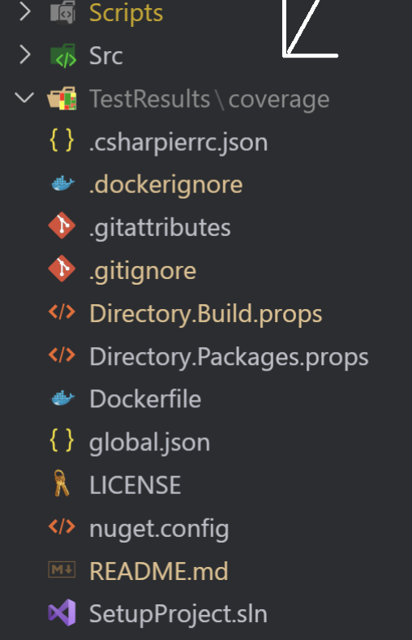

# ASPNET_CORE_VSA_Template

## TL;DR

- The ASP.NET Core template follows the Vertical Slice Architecture (VSA).

- Please leave the name of the repository folder that you have cloned as `ASPNET_CORE_VSA_Template` (default) in order to make the scripts work or check out how to make scripts work with different folder name [Coming soon]().

- For a **introduction about project and each config file**, please check out [Here](./Static/Docs/AGentleIntroduction.md)

- For how to test the project, please check out this [Getting Started](#getting-started)

- For explaination about the src structure, please check out this [Coming soon]()

## Introduction

Welcome to the ASP.NET Core Vertical Slice Architecture Template! This template is designed to help you build maintainable, scalable ASP.NET Core projects that follows the Vertical Slice Architecture (VSA). Its modular approach keeps your codebase clean and easy to navigate as your project grows.

## Context

In the past, I often followed tutorials to build projects, but I encountered significant challenges with the project structures they suggested. Here are some common issues I faced:

- **Long service files**: These became difficult to maintain as they grew in size.
- **Scattered context**: Retrieving all the information related to a feature was challenging because methods and classes were spread across multiple files and folders.
- **Fat controllers**: Controllers often became bloated and hard to manage.

I realized that this approach, known as **technical-based architecture**, groups all files of the same type (e.g., services in a `Services` folder). While this approach seemed organized, it often led to inefficiencies. To address this, I researched **feature-based architecture**, which has the following advantages:

- Each feature has its own dedicated folder, making the structure easier to navigate.
- All files related to a feature are stored together, simplifying maintenance.

However, even with a feature-based architecture, I encountered new challenges as the project grew:

- **Class naming conflicts**: With multiple feature-related classes in one project, it was easy to mistype or confuse class names (e.g., `FM1Endpoint` vs. `FM2Endpoint`).

To solve this, I decided to move each feature into its own class library. This approach makes it impossible to call classes from one feature without explicitly referencing its assembly (e.g., `FM1Endpoint` cannot be called from assembly containing `FM2Endpoint`), reducing the chances of errors.

And that’s how this template was born!

## Demo video

[Coming soon]()

## Getting Started

### Prerequisites

Ensure you have the following installed:

- .NET SDK 8.0.404

### Installation

Clone this project via this command:

```bash
git clone https://github.com/Jackpieking/ASPNET_CORE_VSA_Template.git
```

## Usage

### 1. Navigate to the root of the template

- Windows

```bash
cd E:\CODE_PROJECTS\ASPNET_CORE_VSA_Template\
```

- Mac/Linux

```bash
cd /home/CODE_PROJECTS/ASPNET_CORE_VSA_Template/
```

### 2. Install necessary dotnet tool via this script:

- Windows

```bash
.\Scripts\Init\init.ps1
```

- Mac/Linux

```bash
./Scripts/Init/init.sh
```

### 3. Run the project via this script:

- Windows

```bash
.\Scripts\Run\run.ps1
```

- Mac/Linux

```bash
./Scripts/Run/run.sh
```

## Other usage

### 1. Build the project via this script:

- Windows

```bash
.\Scripts\Build\build.ps1
```

- Mac/Linux

```bash
./Scripts/Build/build.sh
```

### 2. Test the project via this script:

- Windows

```bash
.\Scripts\Test\test.ps1
```

- Mac/Linux

```bash
./Scripts/Test/test.sh
```

--> The result will be in `TestResults` folder, the content inside will be always the newest.



### 3. Publish the project via this script:

- Windows

```bash
.\Scripts\PublishApp\publish.ps1
```

- Mac/Linux

```bash
./Scripts/PublishApp/publish.sh
```

--> The result will be in `out` folder, the content inside will be always the newest.


### 4. Clean the project via this script:

- Windows

```bash
.\Scripts\Clean\clean.ps1
```

- Mac/Linux

```bash
./Scripts/Clean/clean.sh
```

## License

This project is licensed under the [MIT License](https://github.com/Jackpieking/VerticleSliceArchitectureTemplate/blob/master/LICENSE), allowing you to freely use, modify, and distribute it under the terms of the license.

## Contact

For inquiries, please submit questions and other thing related to this project on [GitHub Dicussions](https://github.com/Jackpieking/ASPNET_CORE_VSA_Template/discussions).
