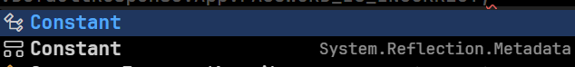

# ASPNET_CORE_VSA_Template

## TL;DR

- The ASP.NET Core template follows the Vertical Slice Architecture (VSA).

- Please leave everything as default in order to make the scripts work or check out **how to customize scripts** [Here](./Static/Docs/ConfigExplaination/CustomizeScript.md).

- For **explanations about idea and structure of template**, please check out [Here](./Static/Docs/TemplateExplaination/AGentleIntroduction.md)

- For more **information about each config file**, please check out [Here](./Static/Docs/ConfigExplaination/Introduction.md)

- For how to **start the project**, please check out [Getting Started](#getting-started)

## Introduction

Welcome to the ASP.NET Core Vertical Slice Architecture Template! This template helps you build maintainable, scalable, and testable web applications by organizing code around business features. It addresses the challenges of traditional layered architectures, such as bloated controllers and scattered code, by promoting a modular and feature-centric approach.

## Demo video

[Coming soon]()

## Context

I used to build projects by following tutorials, but their suggested structures caused problems. I struggled with:

- **Massive service files:** These became unwieldy and hard to maintain as they grew.
- **Dispersed context:** It was difficult to find all the pieces of a feature because they were scattered across different files and folders.
- **Overloaded controllers:** Controllers became bloated and hard to manage.

This traditional, **technical-based architecture**, which groups files by type (e.g., all services in a `Services` folder), seemed organized at first, but it became inefficient. I then explored **feature-based architecture**, which offers:

- **Clearer organization:** Each feature gets its own folder, making navigation easier.
- **Simplified maintenance:** All related files are together.

However, feature-based architecture also presented challenges as projects scaled:

- **Class naming collisions:** With many feature-related classes, it was easy to mix up or mistype names (e.g., `FM1Endpoint` vs. `FM2Endpoint`).

To address this, I moved each feature into its own `assembly (class library)`. This prevents accidental calls between features, as you must explicitly reference the correct assembly (e.g., you can't call `FM1Endpoint` from the `FM2Endpoint` assembly). This also allows for simpler, more consistent naming _within_ each feature, eliminating the need for feature prefixes (e.g., `FM1Endpoint` becomes simply `Endpoint`).

While this could lead to duplicate class names _across_ libraries, this is easily resolved by using the **full class name (namespace + class)**. For example:

We have 2 classes that have the same name like this:



We can decide which one to use by writing the full class name, like this:

```csharp
System.Reflection.Metadata.Constant
```

## Getting Started

### Prerequisites

Ensure you have the following installed:

- .NET SDK `8.0.404`

- Docker (Any version but at least `20.10.17`)

  - please make sure it supports docker compose

- `Text editor` (Vs code, fleet,..) or `IDE` (Visual Studio 2022, Rider, ...)

### Installation

Clone this project via this command:

```bash
git clone https://github.com/Jackpieking/ASPNET_CORE_VSA_Template.git
```

## Usage

### 1. Navigate to the root of the template

- #### Windows

```bash
cd E:\CODE_PROJECTS\ASPNET_CORE_VSA_Template\
```

- #### Mac/Linux

```bash
cd /home/CODE_PROJECTS/ASPNET_CORE_VSA_Template/
```

### 2. Install necessary dotnet tool via this script:

- #### Windows

```bash
.\Scripts\Init\init.ps1
```

- #### Mac/Linux

```bash
./Scripts/Init/init.sh
```

### 3: Update the **`HOST_IP`** var in `.env` file in `./AppInfrastructure` folder (docker stack)

For example:

Currently, in `.env` there is a section at the top expressing docker server IP:

```bash
# ======================
# GLOBAL
# ======================
HOST_IP=192.168.56.104
```

But your docker server IP is `192.168.1.10`, so you must change it to:

```bash
# ======================
# GLOBAL
# ======================
HOST_IP=192.168.1.10
```

### 4: Run docker compose by following command, make sure to stand in `./AppInfrastructure` folder:

```bash
docker compose up -d --build
```

### 5: Find and update the all parts that have `IP` in all `files` that start with `appsettings` in `Src/Entry` folder

For example:

Currently, in `appsettings.Development.json` in `Src/Entry` ther was a connection string for postgressql database like this:

```json
"Database": {
    "Main": {
      "ConnectionString": "Server=192.168.56.104; Port=6102; Database=todoappdb; User ID=admin; Password=Admin123@; SSL Mode=Prefer; Pooling=true; Minimum Pool Size=64; Maximum Pool Size=120; Connection Idle Lifetime=300; Connection Lifetime=500",
      // ... other settings
    }
  }
```

The current postgres server IP is `192.168.56.104`, but your server IP is `192.168.1.10`, so you must change it to:

```json
"Database": {
    "Main": {
      "ConnectionString": "Server=192.168.1.10; Port=6102; Database=todoappdb; User ID=admin; Password=Admin123@; SSL Mode=Prefer; Pooling=true; Minimum Pool Size=64; Maximum Pool Size=120; Connection Idle Lifetime=300; Connection Lifetime=500",
      // ... other settings
    }
  }
```

### 6. Run the project via this script:

- #### Windows

```bash
.\Scripts\Run\run.ps1
```

- #### Mac/Linux

```bash
./Scripts/Run/run.sh
```

## Other usage

### 1. Build the project via this script:

- #### Windows

```bash
.\Scripts\Build\build.ps1
```

- #### Mac/Linux

```bash
./Scripts/Build/build.sh
```

### 2. Test the project via this script:

- #### Windows

```bash
.\Scripts\Test\test.ps1
```

- #### Mac/Linux

```bash
./Scripts/Test/test.sh
```

--> The result will be in `TestResults` folder, the content inside will be always the newest.


### 3. Publish the project via this script:

- #### Windows

```bash
.\Scripts\PublishApp\publish.ps1
```

- #### Mac/Linux

```bash
./Scripts/PublishApp/publish.sh
```

--> The result will be in `out` folder, the content inside will be always the newest.


### 4. Clean the project via this script:

- #### Windows

```bash
.\Scripts\Clean\clean.ps1
```

- #### Mac/Linux

```bash
./Scripts/Clean/clean.sh
```

## License

This project is licensed under the [MIT License](https://github.com/Jackpieking/VerticleSliceArchitectureTemplate/blob/master/LICENSE), allowing you to freely use, modify, and distribute it under the terms of the license.

## Contact

Please submit any problems or questions related to this project on [GitHub issues](https://github.com/Jackpieking/ASPNET_CORE_VSA_Template/issues).
