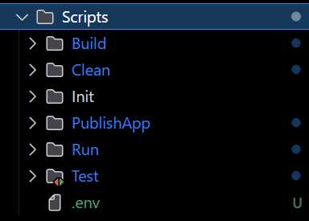
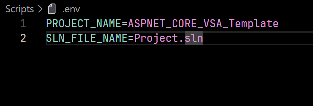

# Customizing Project Scripts for Different Folder Names

This guide explains how to modify the project scripts to work with custom folder names when cloning the repository.

**Why Customize?**

When cloning the repository, you might want to use a new `folder name` other than the default `ASPNET_CORE_VSA_Template` and also a new `sln` file name other than default `Project.sln`. The project scripts rely on these default names, so you'll need to update them to reflect your custom ones.

**How to Update:**

There is an `.env` file in the root directory of `Scripts` folder.

This file only contains two key-value pairs:

- `PROJECT_NAME`

- `SLN_FILE_NAME`.

Open this file and update the values for `PROJECT_NAME` and `SLN_FILE_NAME` to match the names of your custom folder and `sln` file.

And you are **DONE**

## Again: There are more to customize for each **SCRIPT**, but for me, this is enough.
