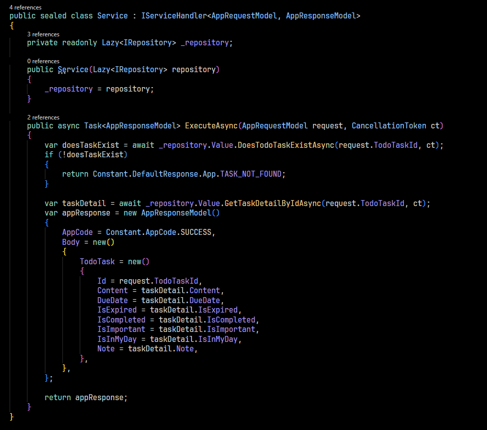

# PART 3 - CODE STRUCTURE DISCUSSION

This section details the code structure within the Core modules, emphasizing the organization of sub-features (or features, if there's only one sub-feature).

### Recall

As discussed in [Part 2](./Part2.md), this architecture concentrates every necessary logics into _Core_, treat _Core_ as the heart of application and each module in _Core_ is also treated as a _sub-feature_, or feature incase it only has 1 _sub-feature_.

**1. Core Module Structure:**

Each sub-feature (or feature) within the Core folder follows a consistent, layered architecture, resembling a traditional 3-layer approach. This structure accommodates the typical components of a feature, allowing for flexibility based on complexity.

**2. Key Components:**

Each feature/sub-feature module typically includes the following components:

- **Business Logic (Required):** This is the heart of the feature, containing the core logic that drives its functionality. It's always present.

- **Presentation (Optional):** This component handles user interaction, such as API endpoints or UI elements. Features like background tasks may not require a presentation layer.

- **Data Access (Optional):** This component manages interactions with databases or other storage systems. Not all features require data access.

- **Registration Center (Required):** This component manages the registration of dependencies of this feature.

**3. Additional Components (Optional):**

Depending on the feature's needs, the following additional components may be included:

- **Common:** Contains shared constants, helper functions, and utilities specific to the feature.

- **Mapper:** Handles the conversion between different object types, such as Entities to Models, and Models to DTOs (Data Transfer Objects).

- **Models:** Defines the core business logic models used by the service. These models are distinct from database entities or DTOs, promoting loose coupling and stability within the business logic.

**4. Example: F15 Module:**

The `F15` module serves as a concrete example. Let's examine its key component:

- **Business Logic:**

  

  - The [`Service.cs`](../../../Src/Core/F15/BusinessLogic/Service.cs) file within the `F15/BusinessLogic` folder contains the core logic of the feature. It typically exposes an `ExecuteAsync` method, which serves as the main entry point for the feature's functionality. Internal methods may be used to support the primary logic within `ExecuteAsync`.

  - Critically, the Business Logic interacts _exclusively_ through its defined interfaces and models. For instance, in the example, the service receives its input via a defined request model [`AppRequestModel.cs`](../../../Src/Core/F15/Models/AppRequestModel.cs) and produces its output using a defined response model [`AppResponseModel.cs`](../../../Src/Core/F15/Models/AppResponseModel.cs).

  **-->** This strict adherence to defined interfaces and models **decouples** the feature's core logic from other components. This decoupling is essential for testability and maintainability, allowing changes to other parts of the module without affecting the core business logic, and vice versa.

# MORE IS COMING
