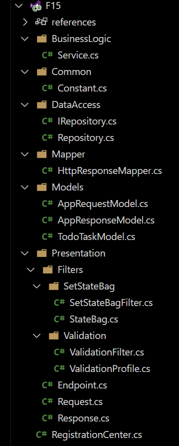

# PART 3 - CODE STRUCTURE EXPLANATION

This section details the code structure within the Core modules, emphasizing the organization of sub-features (or features, if there's only one sub-feature).

### Recall

As discussed in [Part 2](./Part2.md), this architecture concentrates every necessary logics into _Core_, treat _Core_ as the heart of application and each module in _Core_ is also treated as a _sub-feature_, or feature incase it only has 1 _sub-feature_.

**1. Core Module Structure:**

Each sub-feature (or feature) within the Core folder follows a consistent, layered architecture, resembling a traditional 3-layer approach. This structure accommodates the typical components of a feature, allowing for flexibility based on complexity.

**2. Key Components:**

Each feature/sub-feature module typically includes the following components:

- **Business Logic (Required):** This is the heart of the feature, containing the core logic that drives its functionality. It's always present.

- **Presentation (Optional):** This component handles user interaction, such as API endpoints or UI elements. Features like background tasks may not require a presentation layer.

- **Data Access (Optional):** This component manages interactions with databases or other storage systems. Not all features require data access.

- **Registration Center (Required):** This component manages the registration of dependencies of this feature.

**3. Additional Components (Optional):**

Depending on the feature's needs, the following additional components may be included:

- **Common:** Contains shared constants, helper functions, and utilities specific to the feature.

- **Mapper:** Handles the conversion between different object types, such as Entities to Models, and Models to DTOs (Data Transfer Objects).

- **Models:** Defines the core business logic models used by the service. These models are distinct from database entities or DTOs, promoting loose coupling and stability within the business logic.

#### As this is standard practice, I'll skip the 3-layer architecture explanation, which is readily available in numerous YouTube tutorials

---

**FINISH READING?**

**==> CHECK OUT [PART 4](Part4.md)**
