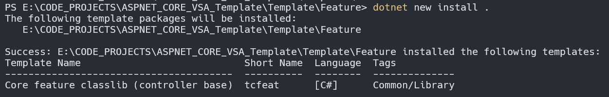
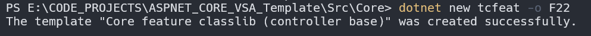
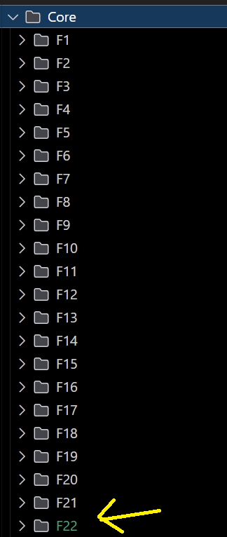
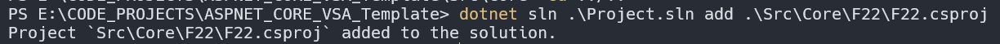
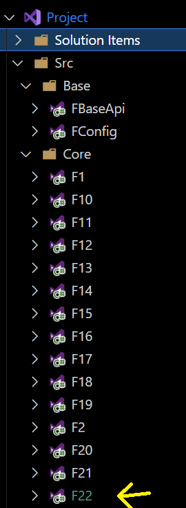
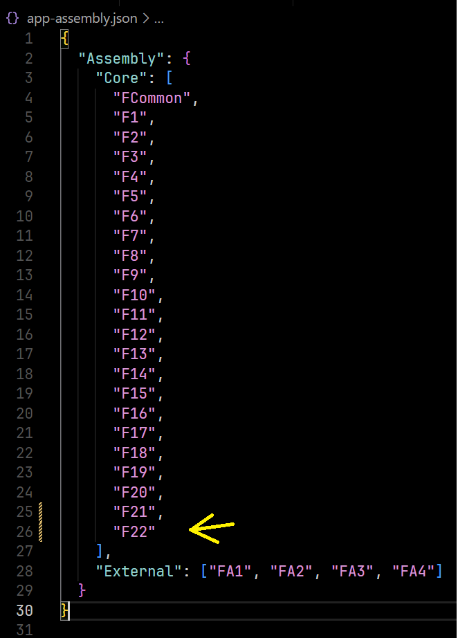
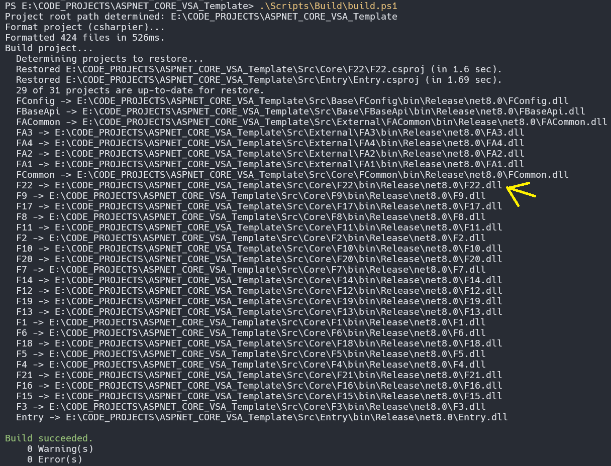

# Part 4 - Workflow Explanation

## Recall

In [Part 3](./Part3.md), we explored the code structure and its components, including features and sub-features. Now, let's go through some example **workflows**

### Introduce A New Feature Workflow (e.g., `F22`)

#### 1. Create a New Feature/Sub-Feature Assembly (Class Library)

To streamline this process, a local template CLI has been set up.

- Navigate to `./Templates/Feature` and install the template by running:

  ```bash
  dotnet new install .
  ```

  This will install a new template called `tcfeat`, which you can use to create feature assemblies.

  

#### 2. Generate the New Feature Module

- Navigate back to the root directory and go to `./Src/Core`.
- Run the following command to create a new feature module named `F22`:

  ```bash
  dotnet new tcfeat -o F22
  ```

  This will generate a new feature module inside `./Src/Core/F22`.

  

  

#### 3. Add the New Module to the Solution File

- Navigate back to the root directory and add the new feature module to the `.sln` file:

  ```bash
  dotnet sln .\Project.sln add .\Src\Core\F22\F22.csproj
  ```

  This ensures that `F22` is included in the solution.

  

  

#### 4. Register the New Module

- Open `app-assembly.json` in the root directory and add the `F22` module name.

  

#### 5. Build the Project

To verify that everything is correctly set up, rebuild the project:

- On Windows:

  ```bash
  .\Scripts\Build\build.ps1
  ```

- On Linux/Mac:

  ```bash
  ./Scripts/Build/build.sh
  ```

  

If the build succeeds, **congratulations!** You are now ready to start coding the `F22` module.
