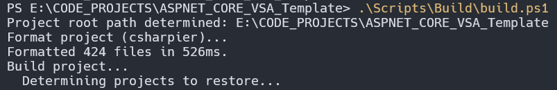
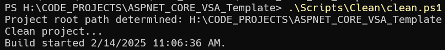
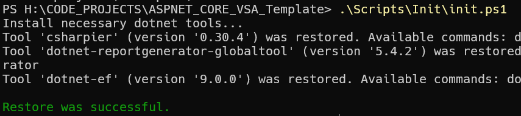
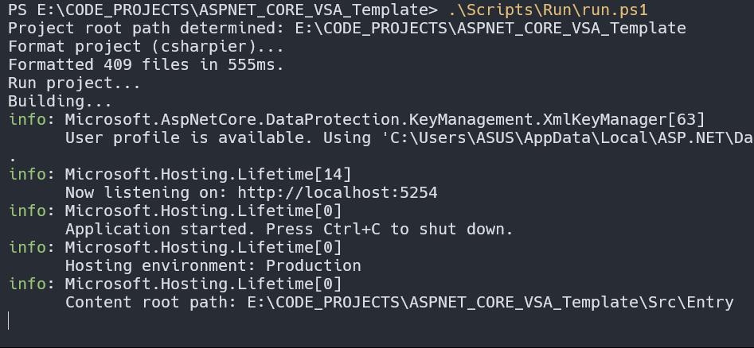
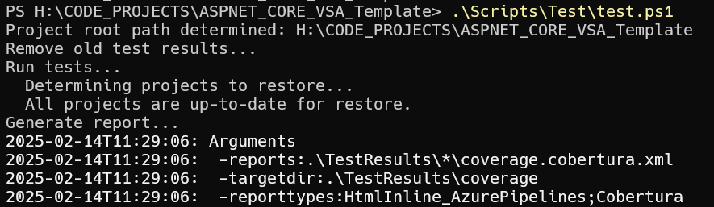

# Part 5 - Scripts Explanation

## All of scripts can be found [HERE](../../../Scripts/)

This project uses scripts to make development easier. Think of scripts like shortcuts for your computer. Instead of typing long, complicated commands every time you want to do something, you just run a short script. This saves you time and prevents errors.

Why use scripts?

* **Simplicity:** Instead of remembering complex commands like `dotnet build`, you just run a script. It's much easier to remember `run build script` than the actual command.

* **Automation:** Some tasks in this project are complicated and involve many steps. Scripts handle all those steps for you automatically. You just run the script, and it takes care of everything behind the scenes.

Here's a breakdown of the different types of scripts:

* **Build Scripts ([HERE](../../../Scripts/Build/)):** These scripts are used to build the project. Building is like assembling the different parts of the project into a working application. Think of it like putting together a Lego set according to the instructions.

* **Clean Scripts ([HERE](../../../Scripts/Clean/)):** These scripts clean up the project. In this context, it means removing all the files created during the build process. This ensures a fresh start for the next build, like clearing your Lego table before starting a new set.

* **Init Scripts ([HERE](../../../Scripts/Init/)):** These scripts initialize (or set up) the necessary tools for the project, like `dotnet csharpier` and `dotnet ef`. These tools help with coding and database management. It's like gathering all the tools you need before starting a Lego project.

* **Publish App Scripts ([HERE](../../../Scripts/PublishApp/)):** These scripts build the project and publish it. Publishing creates a version of the application that can be shared or deployed. It's like taking a picture of your finished Lego creation to share with others. The output goes into a folder called `out`.

* **Run Scripts ([HERE](../../../Scripts/Run/)):** These scripts build the project and then run it. Running the project means starting the application so you can use it. It's like finally getting to play with your completed Lego creation.

* **Test Scripts ([HERE](../../../Scripts/Test/)):** These scripts build the project and then run automated tests.  Think of tests as checking if everything in your project works as expected.  These scripts run those checks for you automatically. The results of these tests are stored in a folder called `TestResults`.  It's like checking if all the pieces of your Lego set fit together correctly and the model works as intended.

